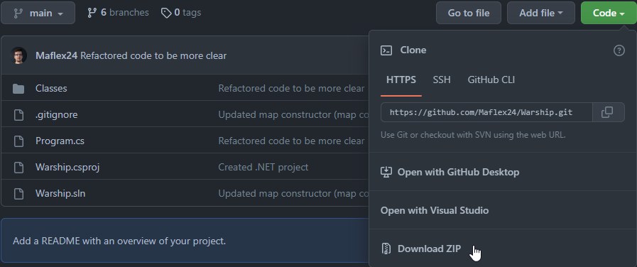
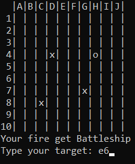

# Warships

Warships is classical console game. Your goal is to destroy all enemy ships. 
You are lucky, because you don't have any ships, which can be destroyed.
It's one sided game. Good luck!

## How to run

### Clone repository

Use command:

```bash
git clone https://github.com/Maflex24/Warship.git
```

Or download repository as .zip file, like here:



### Run using .NET 6

If you have .NET installed on your system you can just use one command in app directory:

```bash
dotnet run
```

If you don't have, you can still get and install from [here](https://dotnet.microsoft.com/en-us/download/dotnet/6.0).

### Run from self-contained files

They are prepared self-contained files in [`Published`](Published/) directory, for Windows, Linux, and OS-X systems.

#### Windows

Type:

```bash
Warships.exe
```

Or just double-click on `Warship.exe` file. 

#### Linux

Type:

```bash
./WarshipsLinux
```

#### Mac-OS

Type 

```bash
open WarshipsOS
```


## How To Play

You have 10x10 map showed on your console. For now all fields are empty. 
It's illusion, on this map are three ships, which you need to destroy. Find them!



To shoot you need to type field coordinate, like: `A7`, `J4`, `C10`. 
A letter don't need to be capitalized, you can type `a7` as well. 

All your shoots will be marked on map. `X` means you missed, `O` means you shooted some ship there. 
You will get information what you shooted. 

## Tests

Project was build by using TDD, there are unit tests for almost every method. 
All test are avalaible on [this repository](https://github.com/Maflex24/Warsip.UnitTests)

